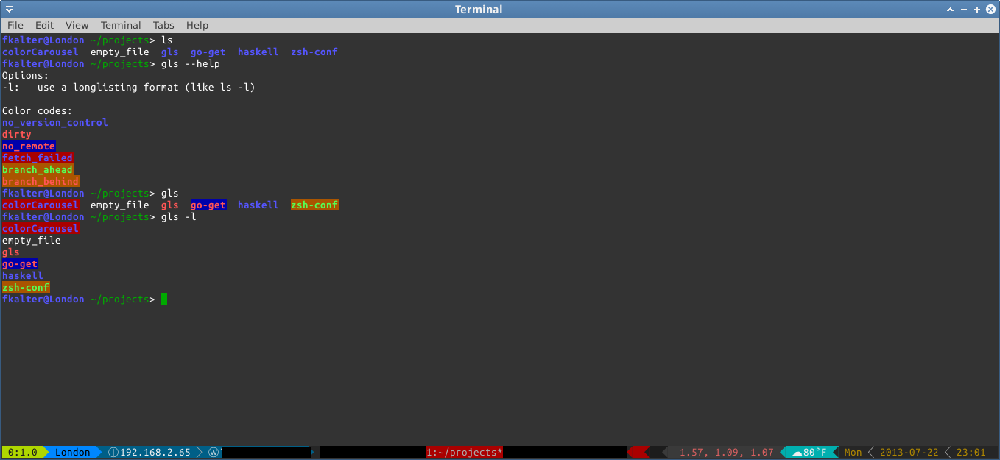

# Gls 

Gls, as in `git ls` . If you are like me and have folder in home directory called "projects" or the like, this command will give a quick color-code
overview of the `git status` of each folder.

# Installation

This tool is written in [go](golang.org), so if you have go installed you can get it with the default *go get* command.
TODO: actualy implement this

    go get github.com/FreekKalter/gls

# Usage

## Color codes

	"no version control":  Blue
	"dirty":               Red
	"no remote":           Red on Blue
	"fetch failed":        Red on Blue
	"branch ahead":        Green on Yellow
	"branch behind":       Red on Yellow

